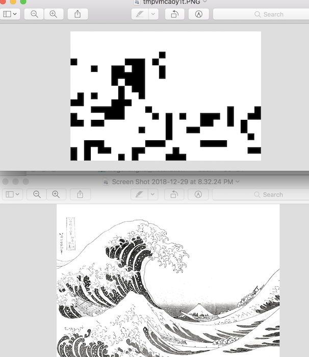

# 28*28 Flip-Dot Display with Arduino and RS485 Use Guide

In this instruction, I will show a way to load a series of images into the 28\*28 Flip-Dot Display XY5 by Alfazeta via Arduino. Prepare all the 28\*28 images in png formats. We first need to use a python script to translate all the images into a 3-layer hex array, then copy the big array into the Arduino code. Ardunio will allow you to decide how the animation be like with all the frames. You can even add sensors and make the display interactive!

### Install Softwares
Download and install [Arduino IDE](https://www.arduino.cc/en/Main/Software)
Open Terminal and check python version
```
$ python -V
```
We can use either python 2 or python 3 in this tutorial. By default MacOS comes with python 2.7. If you are on Windows download [python 2.7](https://www.python.org/download/releases/2.7.6/).
Then we need to install Pillow, a image processing library in Python.
```
$ pip install Pillow
```
If you don't have pip installed
```
$ curl https://bootstrap.pypa.io/get-pip.py > get-pip.py
$ sudo python get-pip.py
```

### Prepare Images
The images to be processed need to be 28\*28 in png format. Place the images in order in a folder and name them as `1.png`, `2.png`, `3.png` etc. The whole folder is on the same level as `array_generator.py`. Check folder `christmas` for a sample format.
PhotoShop is a easy tool to make or edit pixelated images. If you want to convert an image pixelated and get a sense of how it might turn out to be, you can run
```
$ python image_converter.py -f [image_path]
```
To get image_path, you can drag the image directly into terminal in mac. The longer side of the image becomes 28px.


### Process Images
Change directory to this folder in Terminal. Take sample folder `christmas` as example, run
```
$ python array_generator.py -f christmas -n 5
```
Put folder name after `-f` and total number of images after `-n` (if you have `1.png, 2.png, ..., 5.png`, 5 is the total number)
Then you should be able to see a new text file `export_arrays_[yourfoldername].txt` appearing in the folder.

### Modify Arduino Code
Open `control/control.ino` in Arduino IDE. In line 6, change the value of `frame_number` variable to total number of images. Replace the whole line 9 with the exported array that was saved in the text file. In function  `showtime()` on line 35, you can control how the images are displayed. `write_frame(x)` is displaying `x.png` on to the board. `delay(y)` means waiting for y milliseconds until the next image get displayed. In the current script, `showtime()` is looped.  


Now we are good to go! Upload the code to Arduino and enjoy!
